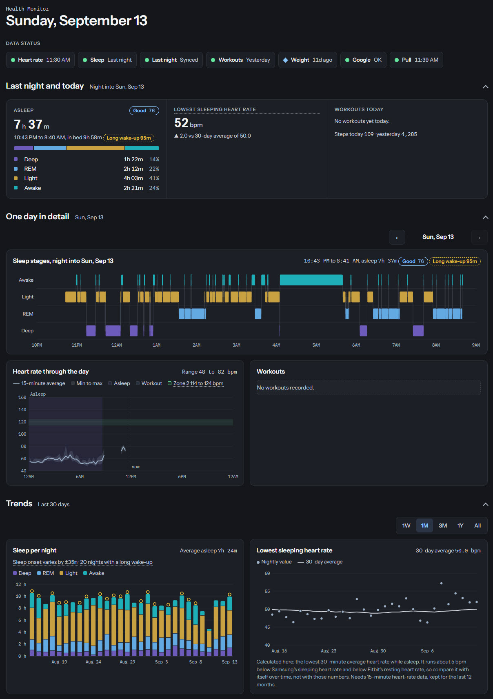

# Google Health Monitor

**Your watch, your chest strap and your scale each keep their own app. This puts the long-term record in one place you control, and hands all of it to you for analysis.**

It has two goals, and they matter equally:

1. **Monitoring.** A live dashboard, on desktop or phone, for health data that reaches Google Health: a Samsung Galaxy Watch through Samsung Health, Polar sessions through Polar Flow, smart-scale readings through their vendor apps, and any older Fitbit history on the same Google account. A Cloudflare Worker pulls it twice a day, stores summaries in D1, and serves the dashboard behind Google sign-in. It charts how nights are structured, how resting heart rate moves over months, and where weight is trending. It is built for progression, not telemetry.
2. **Owning the data for analysis.** One command pulls the entire record to your own machine: per-minute heart rate for every year the account holds, every sleep stage, every workout, every weigh-in and every other metric Google returns. It lands as CSV files, a SQLite database and a data dictionary that spells out every column and every known data problem. That is the form an AI assistant (Claude Code, for example) needs to answer open-ended questions about years of your own data, which no vendor app lets you ask.

**Tested on one setup only:** a Samsung Galaxy Watch 7 paired with a Samsung Galaxy S23, plus a Polar H10 recorded through Polar Beat and an Arboleaf scale. No other watches, phones or scales have been tested. Anything that writes to Health Connect should work in principle, but that is untested.

It runs on Cloudflare's free tier and costs nothing to operate.

---

## Before you read further: what has to be true

**You need all of these:**

| | |
|---|---|
| **A Google account with the Google Health app** | The Android app formerly called Fitbit. It is what copies phone-side Health Connect data into Google's cloud. |
| **Health Connect on an Android phone** | Samsung Health, Polar Flow or your scale's app must be allowed to write into it, and the Google Health app must be allowed to read from it. |
| **A Cloudflare account with a domain** | The dashboard lives on a custom hostname behind Cloudflare Access. |
| **Pushover (optional)** | For the "data stopped arriving" alerts. $4.99 once per platform. |

**This is for you if** you wear a Samsung watch (or anything else that writes to Health Connect), you want years of sleep, heart-rate and weight trends somewhere other than a vendor app, and you are comfortable running `wrangler`.

**This is not for you if** you want realtime data, multiple users, or anything that writes back into Google Health. None of those are goals.



The screenshot shows the author's own data, shared on purpose.

---

## Why this architecture

Every obvious route to the data is closed:

- **Samsung Health has no personal cloud API.** Its SDK is Android-only and gated behind a partner program.
- **The Google Fit REST API is gone.** Signups closed in May 2024 and it was turned down in June 2025.
- **The Fitbit Web API is being turned down in September 2026,** and new developer accounts are no longer issued.
- **Health Connect is not a cloud service.** It is an on-device store gated by Android permissions, with nothing on a server to poll.

The route that works is the **Google Health API (v4)**. The Google Health app on the phone reads Health Connect and syncs what it finds to your Google account. The API then returns it with the writing app attached to every record, for example `dataSource.application.packageName = "com.sec.android.app.shealth"`. That lets a Worker pull, on a schedule, data that otherwise never leaves the phone.

The catch: data reaches Google only when the source apps sync. A Samsung Health update that sat unopened stopped everything for ten days, which is why "data stopped arriving" is the one alert that always matters.

---

## What it costs

| | |
|---|---|
| Google Health API | **$0**. No billing account needed. |
| Cloudflare Workers, D1, Access (up to 50 users) | **$0** on the free tiers |
| Pushover | **$4.99 once**, optional |

Two things to know:

- **Google's paid security review does not apply.** The Google Health API's scopes are "restricted", and verification (with a third-party security assessment) is only required to go beyond 100 users. A single-user app runs unverified.
- **The OAuth app must be published.** While it stays in "Testing", Google expires the refresh token every 7 days and the Worker loses access weekly. Publishing needs a homepage and a privacy-policy URL; the Worker serves both at `/about` and `/privacy`.

The free Worker plan allows 10 ms of CPU per request. Heart rate is pulled pre-summarized through the API's `rollUp` endpoint, and long ranges are downsampled on the server, so every path fits.

---

## What you get

- **Sleep graded on Samsung's scale.** Every night gets Samsung's four labels: Excellent, Good, Fair or Attention. Nights covered by an imported Samsung Health export show Samsung's own sleep score, exactly as the watch app grades it. Nights that arrive daily through Google get an estimate from a model fitted to Samsung's scores, which matched Samsung's label on about 78% of held-out nights; it is marked as an estimate until the next import replaces it.
- **Long wake-ups clearly marked.** Any awakening in the middle of the night lasting 15 minutes or more is flagged as a "Long wake-up" with its length, on the Last night card, next to the night's sleep stages, and as a marker on that night's bar in the sleep trend.
- **Data status.** A row of chips shows when each source last delivered: heart rate, sleep, whether last night has synced, workouts, weight, Google access and the last pull. Hover for what each one means.
- **Last night and today.** Time asleep, with hours and percentages for Deep, REM, Light and Awake; the sleep label; the long wake-up flag; lowest sleeping heart rate against its 30-day average; today's workouts and watch steps.
- **One day in detail.** A hypnogram, heart rate through the day in 15-minute min/avg/max bands with sleep, workouts and an estimated Zone 2 band shaded, the workout list, and Samsung's nightly values (sleeping HRV, skin temperature, respiratory rate, SpO2, stress) when imported.
- **Trends.** Sleep by stage with long wake-ups marked and bedtime regularity, lowest sleeping heart rate, weight and body fat (each with a 7-day rolling median and scale-change bands), exercise minutes by type, daily watch steps (gap days shown as missing, never zero) and optional Samsung-export cards, over 1W, 1M, 3M, 1Y or All. Known vendor algorithm changes can be drawn as dashed markers, so a step in a trend is not read as a change in you.
- **Data health, sync log and data sources.** A "Pull now" button and CSV export above a 26-week coverage calendar, a separate sync log, and a collapsed panel showing which device supplied each metric when. Sections fold when they hold no fresh data, and the page remembers your trend range and which sections you opened.
- **Alerts about the pipeline, not about your body.** Pushover messages when watch data stops arriving, the pull keeps failing, or Google access is lost, plus one message when data flows again. Quiet hours hold them overnight.
- **Samsung export import.** Health Connect does not carry everything Samsung records. `tools/samsung_import.py` loads Samsung Health's own "Download personal data" export: it fills nights, workouts, heart rate and steps that never reached Google, and adds Samsung's sleep score, sleeping HR and HRV, skin temperature, respiratory rate, SpO2 and stress. See [Samsung export](docs/04-samsung-export.md).
- **Travel-aware times.** Nights and workouts use the UTC offset stored on each record, so a night abroad shows its local clock.
- **The full record, locally, for AI analysis.** `tools/export_dataset.py` pulls everything the API holds (per-minute heart rate for every year, every sleep stage, every workout and reading, and minute-level activity summed per hour) into CSV files, a SQLite database and a data dictionary. Point an AI session at the data dictionary first, then the database. See [Dataset export](docs/03-dataset-export.md).

Workouts are cleaned up for display without touching the stored rows. Samsung's auto-pause splits one ride into a new session at every traffic light, so same-type sessions up to 25 minutes apart show as one. Nights Samsung split into sessions up to 120 minutes apart are joined too, with the gap counted as awake. When a Polar chest-strap session covers the same activity, it replaces the watch's segments.

---

## Getting started

Roughly two hours, most of it in Google's and Cloudflare's consoles.

1. **[Google setup](docs/01-google-setup.md)** covers the phone-side prerequisites, the Google Cloud project, OAuth, and a first probe that shows which of your sources actually reach the API.
2. **[Deploy to Cloudflare](docs/02-cloudflare-deploy.md)** covers D1, Cloudflare Access with Google sign-in, secrets, the history import, and the first pull.
3. **[Dataset export](docs/03-dataset-export.md)** covers pulling the full record to your machine for analysis, including with an AI assistant.
4. **[Samsung export](docs/04-samsung-export.md)** covers importing Samsung Health's own export to fill the gaps.

---

## What is in here

```
src/             the Cloudflare Worker
  index.js         router, cron entry, public /about and /privacy
  pull.js          one pull: Google -> D1 -> resting HR -> alerts
  google.js        Google Health API client (heart rate only via rollUp)
  ingest.js        API records -> rows, stage compaction, local dates. Pure
  metrics.js       resting HR, sleep score, workout merging, trends, alert state machine. Pure
  views.js         JSON for the dashboard, downsampled server side
  access.js        Cloudflare Access JWT verification, fails closed
  db.js, notify.js D1 helpers, Pushover
  ui.html, ui.js   the dashboard, no CDN and no build step
  icons.js         app icons, generated by tools/make_icon.py
test/            node --test, no database or network
tools/           OAuth bootstrap and probe, history backfill, dataset export, icon generator
docs/            setup guides
schema.sql       D1 schema
ASSIGNMENT.md    a complete brief for rebuilding this from scratch with an AI agent
```

```bash
npm test
```

---

## Limits

- **Live data is only what Samsung shares.** Samsung Health does not pass HRV, skin temperature, respiratory rate or resting heart rate to Health Connect, and SpO2 and steps arrive only as daily summaries. The rest appears only after a Samsung export import. Resting heart rate is calculated here from overnight heart rate; the others are simply absent.
- **The sleep label is an estimate until you import.** Samsung does not publish its formula or share the score through Health Connect. The estimate is fitted against Samsung's scores from an export; the shipped constants were fitted on one person's nights, so refit on yours. The label cutoffs are an assumption and a setting.
- **Steps are daily totals only.** Samsung sends one total per day, sometimes with multi-week gaps that Google never backfills; the Samsung export fills them. Phone pedometer counts are not charted.
- **Tested on one device set.** Galaxy Watch 7 and Galaxy S23 (with a Polar H10 and an Arboleaf scale). Other hardware is untested.
- **One person.** Multi-user support is a deliberate non-goal.

---

## Built with Claude Code

Built in a single working session with Claude Code, starting from a research brief and a probe of what the Google Health API actually returns for a Samsung setup. [`ASSIGNMENT.md`](ASSIGNMENT.md) is the complete brief for reproducing it: architecture, derived-metric definitions, and the traps that cost time.

## Licence

MIT. See [LICENSE](LICENSE).
